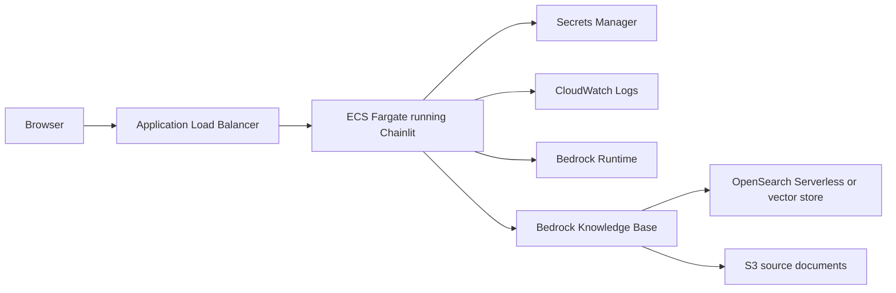

# Chainlit Setup And AWS Deployment Guide

This document captures the end-to-end setup used in this workspace:

- local Chainlit installation
- echo-mode validation
- OpenAI-backed responses
- AWS deployment on ECS Fargate
- Bedrock Knowledge Bases integration

## 1. Local installation

Open a terminal in the project root and run:

```bash
pip install chainlit
chainlit hello
```

If the hello app opens in the browser, Chainlit is installed correctly.

For the latest development version from GitHub:

```bash
pip install git+https://github.com/Chainlit/chainlit.git#subdirectory=backend/
```

Note: the development version may require additional frontend tooling such as Node.js and pnpm.

## 2. Minimal Chainlit app

The project app lives in `demo.py`.

Basic Chainlit pattern:

```python
import chainlit as cl

@cl.on_message
async def main(message: cl.Message):
    await cl.Message(content=f"You said: {message.content}").send()
```

Run the app with:

```bash
chainlit run demo.py --host 0.0.0.0 --port 8000
```

## 3. Echo-mode setup used here

The current app was set up in two phases.

First, echo mode was used to verify that:

- the Chainlit server starts
- the browser can connect
- a submitted message reaches the Python handler
- the UI can render a response

Echo mode is the fastest way to isolate transport issues from model issues.

Current echo behavior:

- if `OPENAI_API_KEY` is not set, the app replies with the user message
- it also explains that the app is still in echo mode

Example behavior:

```text
Echo mode: hello

Set OPENAI_API_KEY to enable real model responses.
```

## 4. OpenAI-backed setup used here

The current `demo.py` supports two runtime modes:

1. Echo fallback when `OPENAI_API_KEY` is missing
2. Real model responses when `OPENAI_API_KEY` is present

Environment template in `.env.example`:

```env
OPENAI_API_KEY=your_openai_api_key_here
OPENAI_MODEL=gpt-4.1-mini
```

How the app works:

- `on_chat_start` checks whether OpenAI is configured
- `on_message` falls back to echo mode if the API key is missing
- otherwise it calls the OpenAI Responses API and returns the model output

To enable model responses locally:

```bash
cp .env.example .env
```

Then edit `.env` and set a real key.

After that, restart the app:

```bash
chainlit run demo.py --host 0.0.0.0 --port 8000
```

## 5. Why echo mode matters

If the UI shows no answer at all, the problem is usually one of these:

- the Chainlit server is not running
- the browser cannot connect back to the server
- the Python handler is not being triggered
- the app is waiting on an external model call that is failing

Echo mode removes the external model dependency and proves the request path is working.

## 6. Recommended AWS deployment method

For a Chainlit app, the recommended AWS deployment path is:

1. Containerize the app
2. Push the image to Amazon ECR
3. Run it on Amazon ECS Fargate
4. Expose it with an Application Load Balancer
5. Store secrets in AWS Secrets Manager
6. Use an ECS task role for Bedrock and other AWS access

This is the preferred method because Chainlit is a long-running web app and benefits from a stable container runtime.

## 7. Recommended AWS architecture



## 8. Why ECS Fargate instead of Lambda

Use ECS Fargate because:

- Chainlit runs as a persistent web server
- websocket-like interaction patterns are easier behind an ALB
- container deployment is straightforward
- task roles make AWS integration cleaner

Avoid Lambda for the main Chainlit UI server unless you are deliberately redesigning the app around a serverless pattern.

## 9. Bedrock Knowledge Bases integration method

The simplest reliable method is to query Bedrock Knowledge Bases from the Chainlit message handler.

Preferred first implementation:

- use `bedrock-agent-runtime`
- call `retrieve_and_generate`
- return the generated answer to Chainlit

Example pattern:

```python
import os
import boto3

bedrock_agent = boto3.client(
    "bedrock-agent-runtime",
    region_name=os.environ.get("AWS_REGION", "us-east-1"),
)

def ask_kb(user_query: str) -> str:
    response = bedrock_agent.retrieve_and_generate(
        input={"text": user_query},
        retrieveAndGenerateConfiguration={
            "type": "KNOWLEDGE_BASE",
            "knowledgeBaseConfiguration": {
                "knowledgeBaseId": os.environ["BEDROCK_KB_ID"],
                "modelArn": os.environ["BEDROCK_MODEL_ARN"],
            },
        },
    )
    return response["output"]["text"]
```

Chainlit handler shape:

```python
import chainlit as cl

@cl.on_message
async def main(message: cl.Message):
    answer = ask_kb(message.content)
    await cl.Message(content=answer).send()
```

## 10. AWS prerequisites for Bedrock KB

Before deployment, create and validate:

1. A Bedrock Knowledge Base
2. A data source for the KB
3. Ingested documents
4. A supported foundation model in the target region
5. An ECS task role with Bedrock permissions

Environment variables to provide:

```env
AWS_REGION=us-east-1
BEDROCK_KB_ID=your_kb_id
BEDROCK_MODEL_ARN=your_model_arn
```

## 11. IAM permissions for the ECS task role

Grant the ECS task role at least:

- `bedrock:Retrieve`
- `bedrock:RetrieveAndGenerate`
- `bedrock:InvokeModel`
- `secretsmanager:GetSecretValue`
- `logs:CreateLogStream`
- `logs:PutLogEvents`

If secrets are encrypted with a customer-managed KMS key, also allow KMS decrypt for that key.

## 12. Containerization

Example `Dockerfile`:

```dockerfile
FROM python:3.12-slim

WORKDIR /app

COPY requirements.txt .
RUN pip install --no-cache-dir -r requirements.txt

COPY . .

EXPOSE 8000

CMD ["chainlit", "run", "demo.py", "--host", "0.0.0.0", "--port", "8000"]
```

Example `requirements.txt` for the AWS KB variant:

```txt
chainlit
boto3
```

If using OpenAI in the deployed version too:

```txt
chainlit
boto3
openai
```

## 13. ECS deployment steps

1. Build the container image locally or in CI
2. Push it to Amazon ECR
3. Create an ECS task definition
4. Attach the task role with Bedrock permissions
5. Configure environment variables and Secrets Manager references
6. Create an ECS Fargate service
7. Attach the service to an ALB target group on port `8000`
8. Configure health checks on `/`
9. Review CloudWatch logs for startup and request handling

Suggested starting capacity:

- 0.5 vCPU
- 1 GB RAM
- 1 running task

## 14. Networking guidance

Recommended production layout:

- public subnets for the ALB
- private subnets for ECS tasks
- NAT gateway or appropriate egress for AWS service access

For a prototype, public tasks can work, but private tasks are the cleaner production approach.

## 15. Secrets management

Do not hardcode secrets in the repository.

Use:

- ECS task role for AWS credentials
- AWS Secrets Manager for non-AWS secrets
- environment variables for non-sensitive configuration

For Bedrock usage inside ECS, prefer IAM task roles instead of static AWS access keys.

## 16. Better RAG control pattern

`retrieve_and_generate` is the fastest way to launch, but a more controllable pattern is:

1. call `retrieve`
2. inspect or filter chunks
3. build your own prompt
4. call `bedrock-runtime`
5. return the answer with citations in Chainlit

Use this pattern when you need stronger citation control, chunk inspection, or prompt customization.

## 17. Practical rollout plan

Recommended order of execution:

1. Confirm echo mode locally
2. Confirm OpenAI mode locally
3. Replace the OpenAI path or add a Bedrock KB path
4. Containerize the app
5. Deploy to ECS Fargate
6. Validate ALB access and logs
7. Load test and refine task sizing

## 18. Current workspace notes

Current relevant local files:

- `demo.py`
- `.env.example`
- `chainlit.md`

The project also contains cloned upstream repositories under `Chainlit-org/`, but those are separate clones and not required for the local demo app itself.
